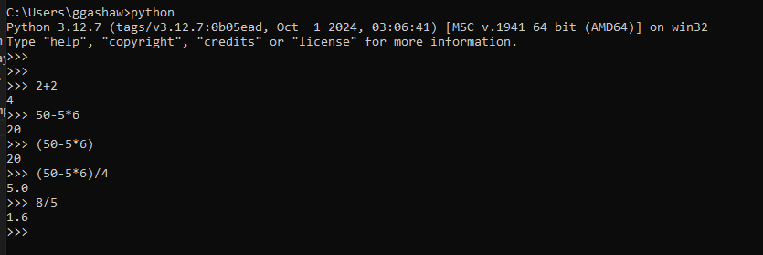

Python’s interpreter moonlights as a pocket calculator. Whenever you type an expression, it cheerfully prints the result.

Arithmetic feels familiar:
- `+` addition
- `-` subtraction
- `*` multiplication
- `/` division (always float!)
- `()` for grouping, just like math class

Try these tasty examples:



Powers are handled using `**`:

## 3.1.2 Text

Python can manipulate text (represented by the type `str`, so-called “strings”) as well as numbers. This includes characters like `!`, words like `rabbit`, names such as `Paris`, and full sentences: `Got your back.` or even joyful emojis like `Yay! :)`.

Strings can be enclosed in **single quotes** (`'...'`) or **double quotes** (`"..."`) with the same result.
```
print('spam eggs' )

print("Paris rabbit got your back :)! Yay!")
print('1975')
```
